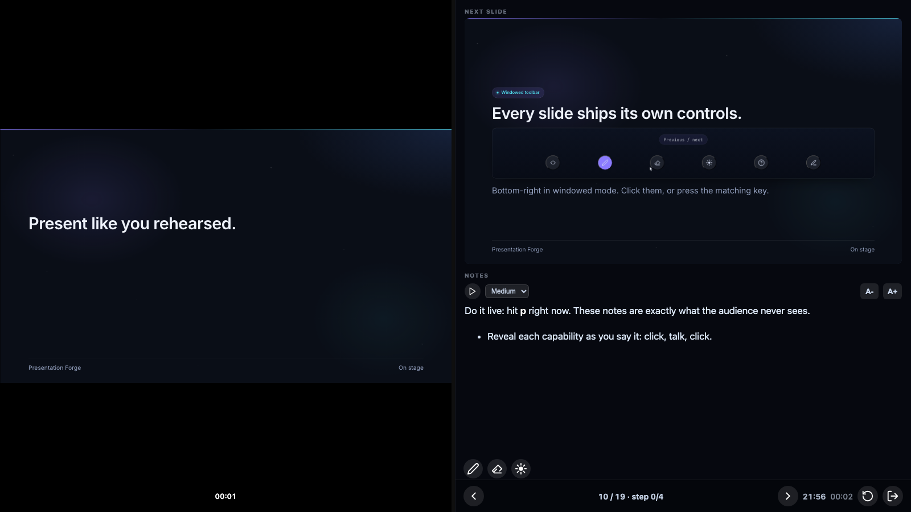
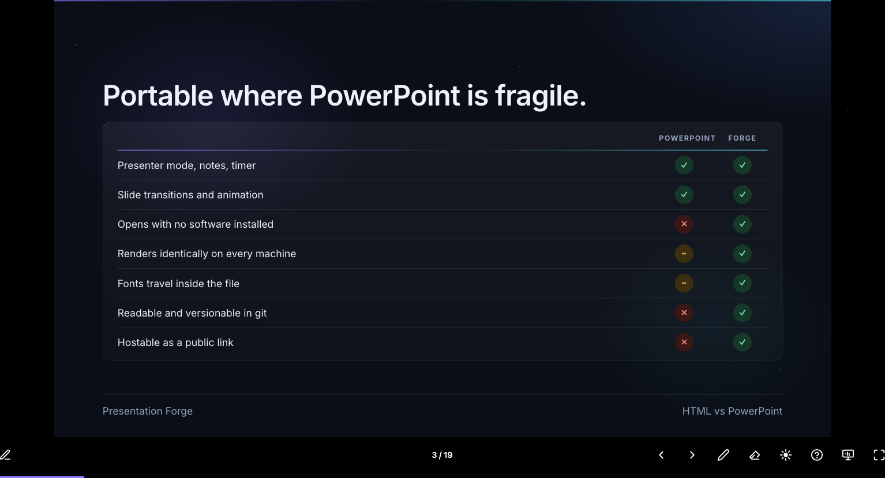

<p align="right"><a href="./README.md">English</a> | <b>Français</b></p>

<h1 align="center">Presentation Forge</h1>

<p align="center">
  <b>Décrivez votre présentation à Claude. Il rédige les slides et les assemble dans un unique <code>index.html</code> portable que vous pouvez double-cliquer, envoyer par mail ou héberger n'importe où.</b>
</p>

<p align="center">
  <a href="https://github.com/thmsgo18/presentation-forge/actions/workflows/ci.yml"></a>
  <a href="LICENSE"></a>
  
  
  
</p>

<p align="center">
  <a href="https://thmsgo18.github.io/presentation-forge/"><b>Démo live</b></a> •
  <a href="#installation">Installation</a> •
  <a href="#pourquoi-du-html-pas-du-powerpoint">Pourquoi le HTML</a> •
  <a href="#ce-quil-sait-faire">Ce qu'il sait faire</a> •
  <a href="#exemple">Exemple</a> •
  <a href="#fonctionnement">Fonctionnement</a> •
  <a href="#thèmes">Thèmes</a>
</p>

---

Un skill [Claude](https://claude.com) qui transforme du langage naturel en présentations soignées. Vous dites *"fais-moi une présentation sur X"* ; Claude structure le deck, rédige les slides, choisit ou construit un thème, et compile le tout dans un unique **`index.html` autonome**. Moteur, thème, polices et images sont tous embarqués : le fichier s'ouvre d'un double-clic, s'envoie proprement par mail et fonctionne hors ligne. Pas de framework, pas de serveur de build, aucune dépendance.

C'est un **Agent Skill** : un seul dossier qui fonctionne pareil dans **Claude Code**, les **apps Claude** (claude.ai et desktop) et via l'**API**. Aucune commande à retenir, il suffit de demander.

## Installation

Installez-le une fois sur chaque surface où vous le voulez.

**Claude Code** : déposez le skill dans votre dossier de skills, Claude le détecte tout seul :

```bash
git clone https://github.com/thmsgo18/presentation-forge.git ~/.claude/skills/presentation-forge
```

(Pour un seul projet, clonez plutôt dans `.claude/skills/presentation-forge/` au sein du dépôt concerné.)

**Apps Claude** (claude.ai et desktop) : importez **`dist/presentation-forge-skill.zip`** dans **Réglages → Fonctionnalités → Skills** (Pro, Max, Team ou Enterprise, avec l'exécution de code activée).

**API** : importez le même `dist/presentation-forge-skill.zip` via l'API Skills (`/v1/skills`) et référencez-le depuis le conteneur d'exécution de code.

> Les skills personnalisés ne se synchronisent pas entre surfaces. Importez le zip une fois par surface.

## Pourquoi du HTML, pas du PowerPoint

Claude sait déjà cracher un `.pptx`. Mais un `.pptx` reste prisonnier de PowerPoint : il faut l'appli pour l'ouvrir, ses polices et sa mise en page dérivent d'une machine à l'autre, et c'est un binaire opaque qu'on ne peut ni lire ni versionner. Un deck Presentation Forge, c'est **un seul fichier HTML** que n'importe quel navigateur rend à l'identique, aujourd'hui comme dans dix ans.

| | PowerPoint `.pptx` | Presentation Forge (HTML) |
| :--- | :---: | :---: |
| Mode présentateur, notes, minuteur | ✅ | ✅ |
| Révélation progressive, pas à pas | ✅ | ✅ |
| Transitions et animations de slides | ✅ | ✅ |
| Images, code, citations, mises en page multi-colonnes | ✅ | ✅ |
| Compatible télécommande ou pointeur de présentation | ✅ | ✅ |
| Fonctionne entièrement hors ligne | ✅ | ✅ |
| S'ouvre sans logiciel, dans n'importe quel navigateur | ❌ | ✅ |
| Rendu identique sur toutes les machines | 🟠 | ✅ |
| Les polices voyagent dans le fichier | 🟠 | ✅ |
| Tient dans un seul fichier autonome | 🟠 | ✅ |
| Modifiable sans logiciel propriétaire | ❌ | ✅ |
| Lisible et versionnable dans git | ❌ | ✅ |
| Hébergeable en lien public | ❌ | ✅ |
| Thème de marque réutilisable entre decks | 🟠 | ✅ |
| Aucun logiciel payant pour créer ou ouvrir | 🟠 | ✅ |

<sub>✅ oui · 🟠 partiel ou fragile · ❌ non. Les premières lignes sont tout ce que PowerPoint offre déjà à un présentateur ; Forge les égale, puis ajoute le reste.</sub>

Vous ne perdez rien de ce que PowerPoint offre à un présentateur, et vous gagnez la portabilité, la durabilité et un fichier qui vous appartient vraiment.

## Ce qu'il sait faire

- 🧠 **N'importe quel brief en deck** : un sujet, un plan, des notes en vrac ou un document entier. Talks techniques, cours, pitchs, conférences, tout sujet.
- ✍️ **Des slides qui font mouche** : titres en assertion, une idée par slide, puces serrées. Les pavés de texte vont dans les notes, pas à l'écran.
- 🎤 **Présenter comme un pro** : mode présentateur intégré avec notes, minuteur et aperçu de la slide suivante. Navigation clavier complète, touche `?` pour les raccourcis.
- ✨ **Révélation progressive** : dérouler un point pas à pas avec `fragment`, la vue présentateur suit chaque étape.
- 🎨 **Thèmes interchangeables** : changer tout le look sans toucher une seule slide.
- 🏢 **Importer une charte** : recréer une identité depuis un `.pptx`, une image ou une description texte, et intégrer un logo d'entreprise.
- 💾 **Enregistrer un style une fois** : exporter tout thème en un seul `.pfstyle.json` et recréer exactement le même look dans n'importe quelle conversation future, sans fichier d'origine.
- 📦 **Sortie en fichier unique** : un `index.html`, prêt hors ligne, zéro dépendance, qui s'ouvre partout où il y a un navigateur.

<p align="center">
  
  
</p>

## Exemple

```
Vous : /presentation-forge fais-moi un deck sur nos résultats du T3 pour
       la réunion d'équipe. Cinq minutes, ton positif. Chiffre d'affaires
       +18%, churn redescendu à 4%, deux nouveaux grands comptes. Utilise
       notre charte, voici le deck du trimestre dernier (.pptx joint).

Claude : [importe la charte du .pptx en thème réutilisable, structure le
         deck, rédige une slide de titre, un sommaire, trois slides de
         contenu menées par une assertion avec leurs notes, et une slide
         de conclusion avec le message clé, puis compile en un index.html]

         C'est fait. Votre deck est dans t3-reunion/index.html (7 slides).
         Ouvrez-le et pressez p pour le mode présentateur, les flèches pour
         naviguer, ? pour tous les raccourcis. J'ai aussi enregistré le
         thème dans acme.pfstyle.json pour réutiliser ce look au T4.
```

## Fonctionnement

Trois couches, toujours séparées, pour qu'un deck ne casse jamais quand on le re-thème :

- **moteur** (`template/engine/`) : rendu, mise à l'échelle, navigation, mode présentateur, révélation. Jamais modifié.
- **thème** (`template/themes/<nom>/`) : le look (couleurs, typo, espacements, polices, logos, fonds).
- **contenu** (`slides/`) : les slides, un fichier HTML chacune, ordonnées par nom.

Le build est volontairement banal, et c'est ce qui le rend portable : on écrit les slides dans `slides/`, on lance `python3 build.py`, et il embarque le moteur, le thème, les polices et chaque image dans un unique `index.html`. Les slides sont composées sur un canevas fixe **1920x1080** que le moteur met à l'échelle de n'importe quel écran : un deck rend pareil sur un portable, un vidéoprojecteur ou un téléphone. Contrat de rédaction complet dans [`SKILL.md`](SKILL.md) et [`reference/`](reference/).

## Thèmes

Un thème est un dossier autonome (`tokens.css`, `fonts.css`, `slides.css`, plus `fonts/`, `images/`, `logos/`). Chaque thème définit les mêmes tokens et stylise les mêmes classes de slide, donc changer de thème ne casse jamais un deck. Deux sont livrés d'origine — **obsidian** (le look sombre et éditorial de la [démo live](https://thmsgo18.github.io/presentation-forge/)) et **ink-blue** (clair et sobre). On en construit un à partir d'une charte de quatre façons :

| Source | Ce que fait Claude |
| :----- | :----------------- |
| PowerPoint `.pptx` | Extrait la palette, les polices, les médias embarqués et la géométrie du masque |
| Image (slide ou maquette) | Échantillonne les couleurs dominantes exactes, lit la typo et la mise en page à l'œil |
| Description texte | Traduit les mots de la marque en tokens de design |
| `.pfstyle.json` | Reconstruit le thème entier (CSS, polices, logos, fonds) en une étape |

Quelle que soit la source, le thème s'exporte en un seul fichier portable **`.pfstyle.json`**. Gardez ce fichier et recréez la même identité quand vous voulez. Procédure complète dans [`reference/import-theme.md`](reference/import-theme.md).

## Prérequis

- Un client Claude qui supporte les skills ([Claude Code](https://docs.claude.com/en/docs/claude-code), les apps Claude ou l'API).
- **Python 3.10+**, bibliothèque standard uniquement, pour construire les decks et lire les `.pptx`. Rien d'autre.
- Un navigateur pour voir le résultat.

## Contribuer

Les rapports de bugs et les pull requests sont bienvenus - voir [`CONTRIBUTING.md`](CONTRIBUTING.md) (en anglais). Les changements notables sont suivis dans [`CHANGELOG.md`](CHANGELOG.md) (en anglais).

## Licence

[MIT](LICENSE) © Thomas Gourmelen
